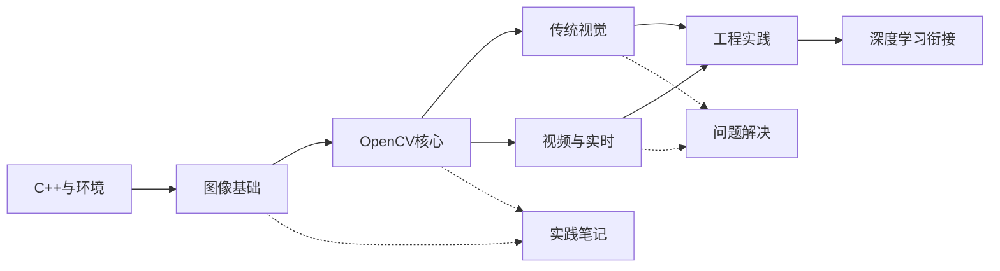

# OpenCV 学习知识库 - 主索引

## 学习目标

- [ ] 能用 C++、CMake 构建 OpenCV 程序
- [ ] 理解像素、通道、颜色空间、矩阵和坐标变换
- [ ] 能独立完成图像读写、预处理、分割和轮廓分析
- [ ] 能处理摄像头和视频流，并达到可接受的实时性
- [ ] 能完成一个传统视觉项目并记录失败案例
- [ ] 能把 OpenCV 与深度学习模型推理连接起来

## 主线关系

## 学习阶段

| 阶段 | 难度 | 入口 |
|---|---|---|
| 01 C++ 与环境 | ★★☆☆☆ | [[01-C++与环境/README]] |
| 02 图像基础 | ★★☆☆☆ | [[02-图像基础/README]] |
| 03 OpenCV 核心 | ★★★☆☆ | [[03-OpenCV核心/README]] |
| 04 传统视觉 | ★★★☆☆ | [[04-传统视觉/README]] |
| 05 视频与实时 | ★★★☆☆ | [[05-视频与实时/README]] |
| 06 工程实践 | ★★★★☆ | [[06-工程实践/README]] |
| 07 深度学习衔接 | ★★★★☆ | [[07-深度学习衔接/README]] |

## 总体进度

- [ ] 环境与 C++ 前置
- [ ] 图像基础
- [ ] OpenCV 核心
- [ ] 传统视觉
- [ ] 视频与实时
- [ ] 工程实践
- [ ] 深度学习衔接
