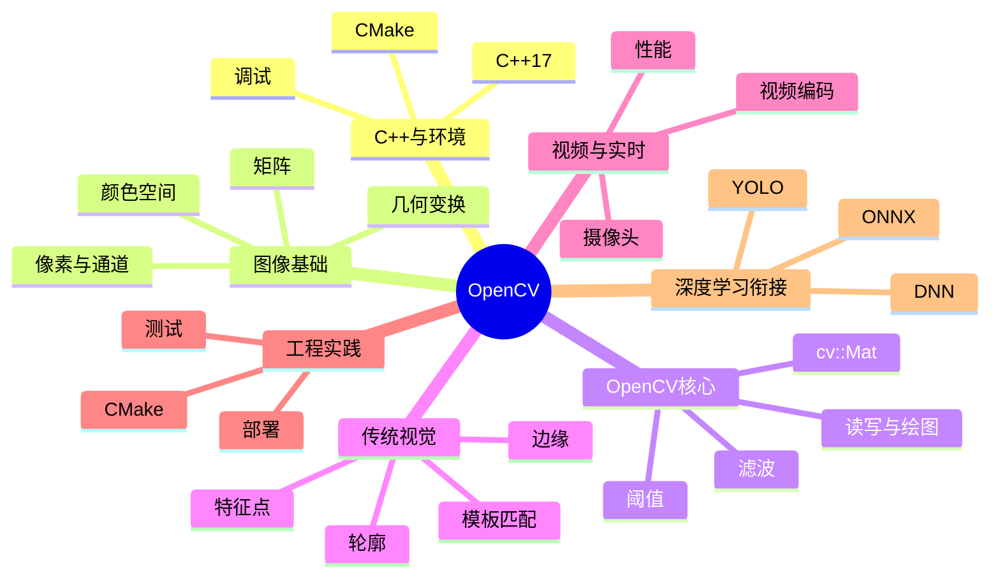

# OpenCV 学习关系图

```mermaid
mindmap
  root((OpenCV))
    C++与环境
      C++17
      CMake
      调试
    图像基础
      像素与通道
      颜色空间
      矩阵
      几何变换
    OpenCV核心
      cv::Mat
      读写与绘图
      滤波
      阈值
    传统视觉
      边缘
      轮廓
      特征点
      模板匹配
    视频与实时
      摄像头
      视频编码
      性能
    工程实践
      CMake
      测试
      部署
    深度学习衔接
      ONNX
      DNN
      YOLO
```
