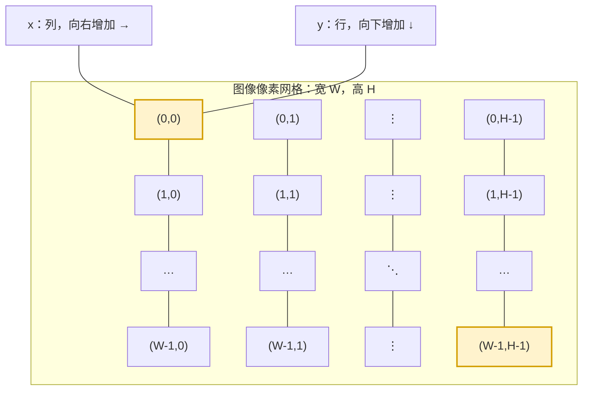

# 像素、通道与位深

理解这三个概念，是读懂 `cv::Mat`、颜色转换、阈值处理和深度学习预处理的基础。

可以先记住一句话：

> 一张图像由许多像素组成；每个像素由一个或多个通道组成；每个通道的数值又由某种位深（数据类型）保存。

例如，普通彩色照片常见的类型是 `CV_8UC3`：

- `8U`：每个通道使用 8 位无符号整数保存，取值通常是 `0~255`。
- `C3`：每个像素有 3 个通道。
- OpenCV 默认顺序是 **B、G、R**，不是很多教材中的 R、G、B。

## 1. 像素：图像中的一个位置

像素（pixel）可以理解为图像网格中的一个最小采样点。对一张宽 `W`、高 `H` 的图像，像素坐标通常写成 `(x, y)`：

- `x` 是列，从左向右增加，范围是 `0~W-1`。
- `y` 是行，从上向下增加，范围是 `0~H-1`。
- 左上角像素是 `(0, 0)`，右下角像素是 `(W-1, H-1)`。

注意：数组访问通常写成 `image.at(y, x)`，也就是**先行后列**，这与坐标常写成 `(x, y)` 的习惯不同。

下面的网格可以帮助记忆坐标方向。每个格子代表一个像素：



因此，图像宽度为 `W` 时，最右一列的 `x` 是 `W-1`；图像高度为 `H` 时，最下一行的 `y` 是 `H-1`。这也是循环通常写成 `x < image.cols`、`y < image.rows` 的原因。

### 灰度像素和彩色像素

灰度图每个像素只有一个数。例如，8 位灰度图中：

- `0` 表示黑色；
- `255` 表示白色；
- `128` 表示中等灰度。

彩色图的一个像素包含多个数。例如 BGR 图像中的一个像素可能是：

```text
(B, G, R) = (20, 120, 240)
```

这表示蓝色分量为 20、绿色分量为 120、红色分量为 240，整体看起来偏红。

## 2. 通道：一个像素中的分量

通道（channel）是描述像素的一组独立数值。常见图像通道如下：

| 图像类型 | 通道数 | 每个像素的含义 |
| --- | ---: | --- |
| Gray | 1 | 一个亮度值 |
| BGR | 3 | 蓝、绿、红 |
| BGRA | 4 | 蓝、绿、红、透明度 |
| HSV | 3 | 色相、饱和度、明度 |

通道数不等于位深。例如：

- `CV_8UC1`：8 位、1 通道；
- `CV_8UC3`：8 位、3 通道；
- `CV_32FC3`：32 位浮点、3 通道。

### BGR 与 BGRA

OpenCV 用 `BGR` 表示普通三通道彩色图。若图像还有透明度，则使用 `BGRA`：

```text
像素 = (Blue, Green, Red, Alpha)
```

`Alpha` 常被用作透明度，但它是否真正有意义取决于图像文件和后续程序。读取 PNG 时，如果需要保留透明通道，应使用 `cv::IMREAD_UNCHANGED`，而不是默认的 `cv::IMREAD_COLOR`。

### 拆分和合并通道

```cpp
std::vector<cv::Mat> channels;
cv::split(bgr, channels);       // channels[0] 是 B，channels[1] 是 G，channels[2] 是 R

cv::Mat merged;
cv::merge(channels, merged);    // 按原顺序重新合并
```

这段代码可以拆成几个动作来理解：

1. `std::vector<cv::Mat> channels;` 创建一个“装 `cv::Mat` 的容器”。`vector` 是 C++ 的动态数组，`Mat` 才是图像矩阵；它不是一张包含很多图片的特殊图像。
2. `cv::split(bgr, channels);` 读取输入图像 `bgr` 的通道，并把每个通道复制成一个独立的单通道 `cv::Mat`，依次放入 `channels`。
3. `channels[i]` 中的 `i` 是从 **0** 开始的下标，不是从 1 开始。
4. `cv::merge(channels, merged);` 按下标顺序把这些单通道矩阵重新组合成一张多通道图像。

以 `CV_8UC3` 的 BGR 图像为例：

| 对象            | 实际含义       | 尺寸      | 类型        |
| ------------- | ---------- | ------- | --------- |
| `bgr`         | 一张彩色图      | `H × W` | `CV_8UC3` |
| `channels[0]` | 所有像素的 B 分量 | `H × W` | `CV_8UC1` |
| `channels[1]` | 所有像素的 G 分量 | `H × W` | `CV_8UC1` |
| `channels[2]` | 所有像素的 R 分量 | `H × W` | `CV_8UC1` |

也就是说，分离后不是得到 3 张“彩色图片”，而是得到 3 个与原图同样宽高的**灰度矩阵**。例如原图某个位置的像素是 `(B,G,R)=(10,80,200)`，那么同一个位置上：

```text
channels[0] 的值是 10
channels[1] 的值是 80
channels[2] 的值是 200
```

如果输入是 `BGRA`（4 通道），下标对应关系就是：

| 下标 | 通道 |
| ---: | --- |
| `channels[0]` | B |
| `channels[1]` | G |
| `channels[2]` | R |
| `channels[3]` | A（透明度） |

因此，BGRA 分离后 `channels.size()` 是 `4`，有效下标是 `0~3`，**没有 `channels[4]`**。访问 `channels[4]` 会越过容器边界，可能导致程序崩溃或产生不可预测结果。不要凭印象写下标，可以先检查：

```cpp
std::cout << "通道数量：" << channels.size() << '\n';
for (size_t i = 0; i < channels.size(); ++i) {
    std::cout << "channels[" << i << "]: "
              << channels[i].rows << "x" << channels[i].cols
              << ", channels=" << channels[i].channels() << '\n';
}
```

`merge` 的输入必须满足一些基本条件：各个通道的宽高相同、深度相同，并且排列顺序就是你希望的顺序。如果把 R 和 B 的矩阵交换后再合并，图像就会出现红蓝颠倒；如果只合并 3 个通道，得到的就是 BGR，而不是 BGRA。

拆出来的每个通道通常是单通道矩阵，尺寸与原图相同。显示单个通道时，它会被当作灰度图显示；如果想保存成彩色图，需要先创建另外两个通道再 `merge`。

## 3. 位深：每个通道如何保存数值

这里的“位深”更准确地说是 OpenCV 的**元素数据类型（depth）**。它描述每个通道使用多少位以及采用整数还是浮点数保存。

| OpenCV depth | C++ 类型   | 常见范围或含义              | depth |
| ------------ | -------- | -------------------- | ----- |
| `CV_8U`      | `uchar`  | `0~255`，最常见的普通图像     | 0     |
| `CV_8S`      | `schar`  | `-128~127`，图像中较少直接使用 | 1     |
| `CV_16U`     | `ushort` | `0~65535`，高位深图像或深度数据 | 2     |
| `CV_16S`     | `short`  | 有符号 16 位整数           | 3     |
| `CV_32S`     | `int`    | 32 位整数，适合标签或索引等数据    | 4     |
| `CV_32F`     | `float`  | 32 位浮点，适合计算和神经网络输入   | 5     |
| `CV_64F`     | `double` | 64 位浮点，需要更高精度时使用     | 6     |

### `CV_<深度>C<通道数>` 类型记法

OpenCV 的类型名由两部分组成：

```text
CV_<深度>C<通道数>
```

例如：

- `CV_8UC1`：8 位无符号、1 通道；
- `CV_8UC3`：8 位无符号、3 通道；
- `CV_16UC1`：16 位无符号、1 通道；
- `CV_32FC3`：32 位浮点、3 通道。

`C1` 可以省略，所以 `CV_8U` 等价于 `CV_8UC1`。

### 每个像素占多少内存

位深是“每个通道”的位数，不是整个像素的总位数。一个像素的存储量可以这样估算：

```text
每像素字节数 = 每通道字节数 × 通道数
```

例如：

- `CV_8UC1`：`1 × 1 = 1` 字节/像素；
- `CV_8UC3`：`1 × 3 = 3` 字节/像素，也就是 24 位/像素；
- `CV_16UC3`：`2 × 3 = 6` 字节/像素，也就是 48 位/像素；
- `CV_32FC3`：`4 × 3 = 12` 字节/像素。

实际行内存还可能包含用于对齐的额外字节，因此不要仅凭“宽 × 高 × 通道数”推断 `Mat` 的全部内存。需要精确检查时可使用：

```cpp
std::cout << "每通道字节数=" << image.elemSize1()
          << ", 每像素字节数=" << image.elemSize() << '\n';
```

可以用代码检查矩阵的深度和通道数：

```cpp
std::cout << "type=" << image.type()
          << ", depth=" << image.depth()
          << ", channels=" << image.channels() << '\n';
```

`type()` 返回的是 OpenCV 内部编码的整数，不适合直接给初学者阅读；排查问题时，通常同时打印 `depth()`、`channels()`、`size()` 和数值范围更直观。

## 4. 数值范围：位深决定容量，但不决定你的约定

位深决定“最多能保存什么数”，但不自动决定这些数在算法中的物理意义。

例如，`CV_32FC1` 可以保存 `0.0`、`0.5`、`1.0`，也可以保存 `128.0` 或 `10000.0`。在图像处理中，浮点图像常见两种约定：

1. 仍然使用 `0~255`，只是把整数换成浮点数；
2. 归一化为 `0~1`，便于神经网络和数值计算。

这两种约定都可以，但必须在整个流程中保持一致。`convertTo` 不会“自动猜测”你的意图：

```cpp
cv::Mat float01;
image.convertTo(float01, CV_32FC3, 1.0 / 255.0); // 8U [0,255] -> 32F [0,1]

cv::Mat image8u;
float01.convertTo(image8u, CV_8UC3, 255.0);       // 32F [0,1] -> 8U [0,255]
```

转换公式是：

```text
目标值 = 原值 × alpha + beta
```

转换到 `CV_8U` 时，超出可表示范围的结果通常会被截断到合法范围。因此，显示前如果图像整体很暗或全黑，先检查是否忘记了乘以 `255`。

### `imshow` 的显示提醒

`cv::imshow` 对不同深度有自己的显示规则：8 位无符号图像按 `0~255` 显示；16 位无符号图像会缩放到显示范围；32/64 位浮点图像通常按 `0~1` 映射到 `0~255`。所以“矩阵里有数”不代表“窗口里一定看得见”，调试时应明确数据范围。

## 5. 在 `cv::Mat` 中访问像素

### 单通道图像

```cpp
uchar gray = image.at<uchar>(y, x);
image.at<uchar>(y, x) = 255;
```

### 三通道 BGR 图像

```cpp
cv::Vec3b pixel = image.at<cv::Vec3b>(y, x);
uchar blue  = pixel[0];
uchar green = pixel[1];
uchar red   = pixel[2];
```

修改像素时可以直接写回：

```cpp
image.at<cv::Vec3b>(y, x) = cv::Vec3b(255, 0, 0); // BGR：纯蓝
```

模板类型必须与矩阵类型匹配。例如，`CV_32FC1` 应使用 `float`，不能使用 `uchar`；`CV_32FC3` 应使用 `cv::Vec3f`。

逐像素 `at` 访问便于学习和调试，但大图像上速度较慢。实际项目中优先使用 OpenCV 的向量化函数、算子或指针遍历。

## 6. 一个可在 Windows 运行的完整示例

下面示例读取一张图片，打印尺寸、通道和位深，读取中心像素，并将三个通道分别保存。假设图片路径为 `D:\learn\Opencv\data\lena.jpg`。

```cpp
#include <opencv2/opencv.hpp>
#include <iostream>
#include <vector>

int main() {
    const std::string path = R"(D:\learn\Opencv\data\lena.jpg)";
    cv::Mat image = cv::imread(path, cv::IMREAD_COLOR);

    if (image.empty()) {
        std::cerr << "无法读取图片：" << path << '\n';
        return 1;
    }

    std::cout << "width=" << image.cols
              << ", height=" << image.rows
              << ", channels=" << image.channels()
              << ", depth=" << image.depth() << '\n';

    const int x = image.cols / 2;
    const int y = image.rows / 2;
    const cv::Vec3b p = image.at<cv::Vec3b>(y, x);
    std::cout << "center BGR = ("
              << static_cast<int>(p[0]) << ", "
              << static_cast<int>(p[1]) << ", "
              << static_cast<int>(p[2]) << ")\n";

    std::vector<cv::Mat> channels;
    cv::split(image, channels);
    cv::imwrite(R"(D:\learn\Opencv\data\blue.png)", channels[0]);
    cv::imwrite(R"(D:\learn\Opencv\data\green.png)", channels[1]);
    cv::imwrite(R"(D:\learn\Opencv\data\red.png)", channels[2]);

    cv::imshow("BGR image", image);
    cv::waitKey(0);
    return 0;
}
```

Windows 路径有两个常见写法：

- 使用原始字符串：`R"(D:\learn\Opencv\data\lena.jpg)"`，反斜杠不用重复；
- 普通 C++ 字符串中写成：`"D:\\learn\\Opencv\\data\\lena.jpg"`。

PowerShell 中运行已生成的程序示例：

```powershell
cd D:\learn\Opencv\build
.\pixel_demo.exe
```

如果使用 CMake，`CMakeLists.txt` 可以写成：

```cmake
cmake_minimum_required(VERSION 3.20)
project(pixel_demo)

find_package(OpenCV REQUIRED)
add_executable(pixel_demo pixel_demo.cpp)
target_link_libraries(pixel_demo PRIVATE ${OpenCV_LIBS})
target_include_directories(pixel_demo PRIVATE ${OpenCV_INCLUDE_DIRS})
```

在 PowerShell 中配置和编译：

```powershell
cmake -S . -B build
cmake --build build --config Release
.\build\Release\pixel_demo.exe
```

## 7. 常见错误与排查顺序

### 7.1 把 BGR 当成 RGB

`imread` 读入的三通道图像默认是 BGR。如果交给需要 RGB 的库，先转换：

```cpp
cv::cvtColor(bgr, rgb, cv::COLOR_BGR2RGB);
```

### 7.2 把通道数当成位深

`CV_8UC3` 中的 `3` 是通道数，`8U` 才是位深。增加通道不会自动提高颜色精度；`CV_16UC3` 才是“16 位、3 通道”。

### 7.3 浮点图像显示全黑或全白

检查 `minMaxLoc`：

```cpp
double minValue, maxValue;
cv::minMaxLoc(floatImage, &minValue, &maxValue);
std::cout << minValue << " ~ " << maxValue << '\n';
```

若数据范围是 `0~255`，却按 `0~1` 处理，或反过来，显示和阈值都会出错。需要显示时可先归一化：

```cpp
cv::Mat preview;
cv::normalize(floatImage, preview, 0, 255, cv::NORM_MINMAX, CV_8U);
cv::imshow("preview", preview);
```

### 7.4 `at<>` 类型写错

访问前先确认类型：单通道 8 位用 `uchar`，三通道 8 位用 `cv::Vec3b`，三通道 32 位浮点用 `cv::Vec3f`。类型不匹配可能导致编译错误，也可能产生难以发现的错误结果。

### 7.5 直接修改某个通道导致颜色异常

如果只想把某通道清零，应明确使用 `split` 后修改再 `merge`，或使用正确的 `Vec3b` 下标。记住下标 `0/1/2` 对应 B/G/R，而不是 R/G/B。

## 8. 一张图的快速判断方法

拿到一个 `cv::Mat`，可以按下面顺序检查：

1. `image.empty()`：数据是否成功读取？
2. `image.cols`、`image.rows`：宽高是多少？
3. `image.channels()`：是灰度、BGR 还是 BGRA？
4. `image.depth()`：是 8 位整数、16 位整数还是浮点？
5. `minMaxLoc` 或 `mean`：实际数值范围是什么？
6. 当前算法需要的颜色顺序和数值范围是什么？

只要这六项明确，绝大多数“颜色不对、结果全黑、阈值失效、模型输入异常”问题都能快速定位。

相关内容：[[颜色空间]]、[[矩阵与cvMat思维]]、[[图像读写与显示]]。
