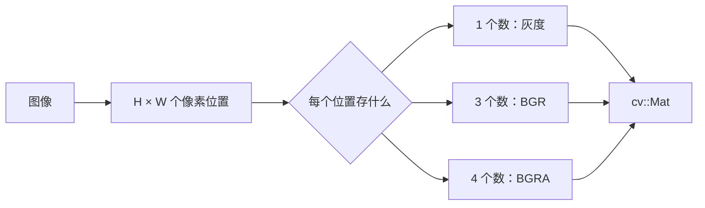

# 矩阵与 `cv::Mat` 思维

很多 OpenCV API 看起来是在“处理图片”，但它们真正处理的是一个或多个矩阵。初学时如果只背函数名，遇到颜色异常、ROI 修改了原图、浮点图像显示全黑等问题会很难定位。本篇先建立矩阵直觉，再理解 `cv::Mat` 的数据结构和内存行为。

## 1. 先建立一个核心直觉：图像就是有规则的数据表

一张高为 `H`、宽为 `W` 的灰度图，可以看成一个 `H × W` 的矩阵：

```text
        x=0   x=1   x=2   ...
y=0     12    18    25    ...
y=1     10    20    30    ...
y=2      8    16    28    ...
...
```

- `y` 表示第几行，方向从上到下；
- `x` 表示第几列，方向从左到右；
- 左上角是 `(x=0, y=0)`；
- C++ 数组访问写作 `image.at<类型>(y, x)`，**先行后列**。

彩色图仍然是同样的二维网格，只是每个格子不再是一个数，而是一个小向量：

```text
灰度：      pixel(y, x) = 128
BGR 彩色：  pixel(y, x) = (B, G, R) = (20, 120, 240)
```

因此，“宽高”和“通道数”是两件事：宽高描述网格有多少行列，通道数描述每个格子里有几个数。



## 2. `cv::Mat` 到底保存了什么

可以把 `cv::Mat` 想成“**描述一块矩阵数据的对象**”，而不只是一个二维数组。它至少涉及以下信息：

| 信息 | 常用成员或查询方式 | 含义 |
| --- | --- | --- |
| 行数 | `rows` | 图像高度 `H` |
| 列数 | `cols` | 图像宽度 `W` |
| 维度 | `dims` | 通常图像为 2 维，也可表示更高维数组 |
| 元素类型 | `type()`、`depth()`、`channels()` | 每个元素的深度和通道数 |
| 数据地址 | `data` | 第一行数据的起始地址 |
| 行跨度 | `step` | 从一行起点到下一行起点的字节数 |
| 共享生命周期 | 引用计数（内部管理） | 多个 `Mat` 可共享同一块数据 |

这里的“元素”通常指一个像素。例如 `CV_8UC3` 中，一个元素是一个包含 B、G、R 三个 `uchar` 的像素，而不是单独的某个通道值。

检查一个矩阵时，建议一次打印这些信息：

```cpp
std::cout << "size=" << image.cols << "x" << image.rows
          << ", dims=" << image.dims
          << ", channels=" << image.channels()
          << ", depth=" << image.depth()
          << ", type=" << image.type()
          << ", continuous=" << std::boolalpha
          << image.isContinuous() << '\n';
```

`type()` 是 OpenCV 内部编码的整数，适合排查问题，但不如 `depth()` 和 `channels()` 直观。类型的详细读法见下一节。

## 3. 读懂 `CV_8UC3`：深度 + 通道数

OpenCV 类型通常写成：

```text
CV_<深度>C<通道数>
```

常见类型如下：

| 类型 | 每通道 C++ 类型 | 通道数 | 常见用途 |
| --- | --- | ---: | --- |
| `CV_8UC1` | `uchar` | 1 | 8 位灰度、掩膜 |
| `CV_8UC3` | `uchar` | 3 | 普通 BGR 彩色图 |
| `CV_8UC4` | `uchar` | 4 | BGRA、带透明度的图 |
| `CV_16UC1` | `ushort` | 1 | 16 位深度图、高位深图像 |
| `CV_32FC1` | `float` | 1 | 浮点中间结果、概率图 |
| `CV_32FC3` | `float` | 3 | 浮点彩色数据、网络输入 |
| `CV_64FC1` | `double` | 1 | 需要更高精度的数值计算 |

其中：

- `8U` 是深度（8 位无符号整数），不是“8 个通道”；
- `C3` 是通道数为 3；
- `CV_8U` 可以看作 `CV_8UC1` 的简写。

深度决定单个通道能保存的数值范围，但不决定算法约定。例如 `CV_32FC1` 既可以保存 `0~1` 的归一化值，也可以保存 `0~255` 的浮点值。使用浮点矩阵时，一定要记录并保持自己的数值约定。

## 4. 创建矩阵：未初始化和初始化要分清

```cpp
cv::Mat a(2, 3, CV_8UC1);                    // 仅分配内存，数值未定义
cv::Mat zeros = cv::Mat::zeros(2, 3, CV_8UC1); // 全 0
cv::Mat ones = cv::Mat::ones(2, 3, CV_32FC1);  // 全 1.0f
cv::Mat color(2, 3, CV_8UC3, cv::Scalar(10, 20, 30)); // 每个像素都是 BGR=(10,20,30)
cv::Mat identity = cv::Mat::eye(3, 3, CV_32FC1); // 单位矩阵
```

`cv::Mat a(2, 3, CV_8UC1)` 不会自动填零。若后续代码依赖初始值，应明确使用 `zeros`、`ones` 或 `setTo`：

```cpp
a.setTo(7);                              // 所有元素设为 7
color.setTo(cv::Scalar(0, 255, 0));       // 所有像素设为绿色（BGR）
```

也可以用逗号初始化快速构造小矩阵，适合讲解和单元测试：

```cpp
cv::Mat small = (cv::Mat_<int>(2, 3) <<
    1, 2, 3,
    4, 5, 6);
```

## 5. 浅拷贝、深拷贝：最容易踩坑的部分

`cv::Mat` 由“头部信息”和“像素数据”组成。赋值时通常只复制头部，并让两个对象指向同一块数据：

```cpp
cv::Mat image = cv::Mat::zeros(2, 3, CV_8UC1);
cv::Mat view = image;          // 浅拷贝：共享像素数据
cv::Mat copy = image.clone();  // 深拷贝：复制一份独立像素数据

image.at<uchar>(0, 0) = 255;
std::cout << view.at<uchar>(0, 0) << '\n'; // 也会看到 255
std::cout << copy.at<uchar>(0, 0) << '\n'; // 仍是复制时的旧值
```

`copyTo` 也会产生独立数据：

```cpp
cv::Mat copy2;
image.copyTo(copy2);
```

可以用下面的规则做判断：

| 写法 | 是否共享像素数据 | 典型用途 |
| --- | --- | --- |
| `cv::Mat b = a;` | 是 | 快速传递、只读处理 |
| `cv::Mat b(a);` | 是 | 与上面等价 |
| `a.clone()` | 否 | 需要完全独立的副本 |
| `a.copyTo(b)` | 否 | 复制到已有或新建矩阵 |
| `a(rect)` | 通常是 | ROI 视图，避免复制 |

函数参数也应注意这一点。`void process(cv::Mat image)` 传入的是一个新的头部，但仍共享数据；若函数只读，推荐写成 `const cv::Mat&`；若函数要修改原图，可以明确写成 `cv::Mat&`，让调用者知道会发生修改。

```cpp
void inspect(const cv::Mat& image); // 只读，不复制像素
void drawOn(cv::Mat& image);        // 明确修改调用者的矩阵
```

## 6. ROI、行列范围也通常是“视图”

ROI（Region of Interest，感兴趣区域）是原矩阵的一部分：

```cpp
cv::Rect box(10, 20, 100, 80); // x, y, width, height
cv::Mat roi = image(box);      // 通常不复制像素，只创建视图
roi.setTo(cv::Scalar(0, 0, 0)); // 原图对应区域也会变黑
```

如果只想从原图读取或在原图上就地处理，视图很高效；如果要把 ROI 保存为独立结果，必须复制：

```cpp
cv::Mat independentRoi = image(box).clone();
```

外部检测框可能超出图像边界，构造 ROI 前先求交集：

```cpp
cv::Rect imageRect(0, 0, image.cols, image.rows);
cv::Rect safeBox = box & imageRect;
if (safeBox.area() > 0) {
    cv::Mat roi = image(safeBox);
}
```

下面这些操作也常返回视图，而不是复制：

```cpp
cv::Mat top = image.rowRange(0, image.rows / 2);
cv::Mat left = image.colRange(0, image.cols / 2);
```

若不确定某个子矩阵是否仍与原图共享，最简单、最安全的做法是对结果调用 `clone()`。更深入的 ROI 用法见 [[03-OpenCV核心/Mat与ROI]]。

## 7. `step`、连续内存与 `isContinuous()`

逻辑上，矩阵有 `rows × cols` 个元素；物理上，每一行可能为了对齐而比“有效像素字节数”更长。`step` 表示一行起点到下一行起点之间的字节数：

```text
下一行地址 = 当前行地址 + step
```

对 `CV_8UC3` 图像，一行有效数据需要 `cols × 3` 字节，但 `step` 可能略大于这个值。ROI 尤其容易保留父图像的行跨度，所以不要默认整块内存没有间隙。

```cpp
std::cout << "elemSize1=" << image.elemSize1()  // 每通道字节数
          << ", elemSize=" << image.elemSize() // 每个像素字节数
          << ", step=" << image.step << '\n';  // 每行跨度（字节）
```

- `image.isContinuous() == true`：所有行首尾相接，可以把数据当作一维连续数组处理；
- 返回 `false`：遍历时应按行处理，不能直接跨行当作连续内存使用；
- `clone()` 通常会生成连续的新矩阵，但写通用代码仍建议检查 `isContinuous()`。

典型的安全遍历写法：

```cpp
for (int y = 0; y < image.rows; ++y) {
    const cv::Vec3b* row = image.ptr<cv::Vec3b>(y);
    for (int x = 0; x < image.cols; ++x) {
        const cv::Vec3b& pixel = row[x];
        // pixel[0]、pixel[1]、pixel[2] 分别是 B、G、R
    }
}
```

`reshape` 只改变矩阵的“解释方式”，不复制数据；当需要改变行数时通常要求矩阵连续：

```cpp
if (image.isContinuous()) {
    cv::Mat oneRow = image.reshape(image.channels(), 1);
}
```

初学阶段不必手动操作 `data`，先掌握 `at`、`ptr`、`clone` 和 ROI 就足够了。

## 8. 像素访问：`at` 适合学习，`ptr` 适合批量遍历

模板类型必须与矩阵类型匹配：

```cpp
uchar gray = grayImage.at<uchar>(y, x);       // CV_8UC1
cv::Vec3b bgr = colorImage.at<cv::Vec3b>(y, x); // CV_8UC3
float value = floatImage.at<float>(y, x);     // CV_32FC1
cv::Vec3f p = floatColor.at<cv::Vec3f>(y, x); // CV_32FC3
```

`uchar` 输出到 `std::cout` 时可能被当成字符，调试数值要显式转换：

```cpp
    std::cout << static_cast<int>(gray) << '\n';
```

`at` 的下标顺序是 `(y, x)`，越界访问属于错误。循环边界应写成：

```cpp
for (int y = 0; y < image.rows; ++y)
    for (int x = 0; x < image.cols; ++x)
        /* image.at<...>(y, x) */;
```

逐像素修改适合学习和少量数据；处理大图像时，优先使用 `cv::add`、`cv::multiply`、`cv::threshold`、滤波等 OpenCV 算子，让库内部使用更高效的实现。

## 9. 矩阵运算和数值范围

OpenCV 的矩阵运算通常按元素进行，而不是默认做线性代数中的矩阵乘法：

```cpp
cv::Mat a = cv::Mat::ones(2, 3, CV_32FC1);
cv::Mat b = cv::Mat::ones(2, 3, CV_32FC1) * 2.0f;
cv::Mat sum = a + b;                    // 对应元素相加
cv::Mat product = a.mul(b);             // 对应元素相乘
cv::Mat algebraic = a * b.t();          // 这里才是矩阵乘法（尺寸需匹配）
```

对 `CV_8U` 直接做运算时，结果会受到 8 位范围 `0~255` 的限制；需要保留负数或小数时，先转成浮点：

```cpp
cv::Mat floatImage;
image.convertTo(floatImage, CV_32F, 1.0 / 255.0); // [0,255] -> [0,1]
```

`convertTo` 使用的公式是：

```text
目标值 = 原值 × alpha + beta
```

转换回 8 位图像用于保存或显示：

```cpp
cv::Mat preview8u;
floatImage.convertTo(preview8u, CV_8U, 255.0);
```

显示浮点中间结果前，先确认范围；必要时使用 `normalize` 生成专门的预览矩阵，不要为了显示而误改原始计算数据。注意：`minMaxLoc` 通常要求输入是单通道矩阵；如果当前数据是 BGR 三通道，先选取一个通道：

```cpp
cv::Mat values = floatImage;
if (floatImage.channels() > 1) {
    cv::extractChannel(floatImage, values, 0); // 这里只查看 B 通道
}

double minValue, maxValue;
cv::minMaxLoc(values, &minValue, &maxValue);
std::cout << "range=" << minValue << " ~ " << maxValue << '\n';

cv::Mat preview;
cv::normalize(values, preview, 0, 255, cv::NORM_MINMAX, CV_8U);
```

### 9.1 `convertTo`：类型转换与线性变换

`convertTo` 不只是“把数据类型改一下”，还可以对每个元素执行缩放和平移：

```cpp
src.convertTo(dst, rtype, alpha, beta);
```

各参数含义如下：

- `src`：调用函数的原矩阵；
- `dst`：输出矩阵；
- `rtype`：目标深度，例如 `CV_32F`、`CV_8U`。通常只改变深度，通道数保持不变；如果传入负数，则保持原类型；
- `alpha`：缩放系数，默认是 `1`；
- `beta`：偏移量，默认是 `0`。

对每个位置、每个通道，使用的公式是：

```text
dst(y, x, c) = saturate_cast<目标类型>(src(y, x, c) * alpha + beta)
```

其中 `c` 表示通道。`alpha` 先乘，`beta` 后加；它不是矩阵乘法，而是对每个元素独立计算。

例如，把 `CV_8U` 图像从 `0~255` 转成浮点的 `0~1`：

```cpp
cv::Mat floatImage;
image.convertTo(floatImage, CV_32F, 1.0 / 255.0);
```

如果原值是 `[0, 128, 255]`，结果约为 `[0.0, 0.502, 1.0]`。转换回来时可以使用：

```cpp
cv::Mat image8u;
floatImage.convertTo(image8u, CV_8U, 255.0);
```

如果写成：

```cpp
src.convertTo(dst, CV_32F, 2.0, 10.0);
```

实际执行的就是：

```text
dst = src * 2 + 10
```

当目标类型是整数类型时，结果还会受到目标类型范围限制。例如转成 `CV_8U` 时：

```text
-10  -> 0
100  -> 100
300  -> 255
```

这一步通常称为饱和转换：小于 `0` 的值被限制为 `0`，大于 `255` 的值被限制为 `255`，浮点结果还会进行取整。因此，转成 `CV_8U` 前要确认数据范围，否则可能丢失信息。

`convertTo` 使用的是固定公式，不会自动检查当前数据的最小值和最大值。例如 `[50, 75, 100]` 使用 `alpha=2` 后得到 `[100, 150, 200]`，不会自动变成 `[0, 128, 255]`。

### 9.2 `normalize`：按范围或范数重新缩放

`normalize` 的作用是根据输入数据当前的范围或大小，把数据调整到指定范围，或者让它满足指定的范数。常见形式是：

```cpp
cv::normalize(src, dst, alpha, beta, norm_type, dtype);
```

主要参数含义如下：

- `src`：输入矩阵；
- `dst`：输出矩阵；
- `alpha`：使用 `NORM_MINMAX` 时是目标下限；使用其他范数时是目标范数；
- `beta`：使用 `NORM_MINMAX` 时是目标上限；其他范数通常忽略它；
- `norm_type`：归一化方式；
- `dtype`：输出深度，`-1` 表示保持输入深度；
- `mask`：可选掩膜，只对掩膜指定的区域进行操作。

最常用的 `NORM_MINMAX` 会先找出输入的最小值 `minValue` 和最大值 `maxValue`，然后把它们线性映射到 `[alpha, beta]`：

```text
dst = (src - minValue)
      * (beta - alpha) / (maxValue - minValue)
      + alpha
```

例如：

```cpp
cv::Mat src = (cv::Mat_<float>(1, 3) << 50, 75, 100);
cv::Mat dst;

cv::normalize(src, dst, 0, 255, cv::NORM_MINMAX, CV_8U);
```

输入 `[50, 75, 100]` 会被拉伸到大约 `[0, 128, 255]`：

- 当前最小值 `50` 变成 `0`；
- 当前最大值 `100` 变成 `255`；
- 中间值按照比例映射。

这很适合把浮点算法结果转换成便于观察的预览图：

```cpp
cv::Mat preview;
cv::normalize(result, preview, 0, 255, cv::NORM_MINMAX, CV_8U);
cv::imshow("preview", preview);
```

`normalize` 还可以按照向量范数进行缩放：

- `NORM_L1`：让所有元素绝对值之和等于 `alpha`；
- `NORM_L2`：让所有元素平方和的平方根等于 `alpha`；
- `NORM_INF`：让最大绝对值等于 `alpha`。

例如对 `[3, 4]` 使用 `NORM_L2` 和 `alpha=1`：

```text
sqrt(3^2 + 4^2) = 5
[3, 4] / 5 = [0.6, 0.8]
```

因此：

```cpp
cv::normalize(src, dst, 1.0, 0.0, cv::NORM_L2, CV_32F);
```

常用于特征向量或其他需要统一长度的数据。

### 9.3 `convertTo` 和 `normalize` 的区别

| 对比项 | `convertTo` | `normalize` |
| --- | --- | --- |
| 缩放依据 | 使用固定的 `alpha`、`beta` | 可以根据当前最小值、最大值或范数计算 |
| 典型公式 | `src * alpha + beta` | 按范围或范数归一化 |
| 典型用途 | 类型转换、单位转换、固定范围映射 | 动态范围拉伸、显示中间结果、特征归一化 |
| 不同输入之间的可比性 | 较好，只要使用相同参数 | 逐个输入动态拉伸时可能变差 |

例如，想让不同图片都采用固定的 `0~255 -> 0~1` 规则，应使用：

```cpp
image.convertTo(floatImage, CV_32F, 1.0 / 255.0);
```

如果只是想让某次计算结果显示得更清楚，可以使用：

```cpp
cv::normalize(result, preview, 0, 255, cv::NORM_MINMAX, CV_8U);
```

显示用的 `preview` 最好单独保存，不要为了显示而覆盖原始计算数据。因为 `NORM_MINMAX` 会根据每个输入自己的最小值和最大值重新拉伸，适合观察形状和对比度，但不一定保留不同输入之间的绝对数值关系。

## 10. Windows 优先的完整示例

下面程序演示：读取图片、检查矩阵属性、区分浅拷贝和深拷贝、创建安全 ROI、保存结果。默认路径是 Windows 原始字符串，也可以在命令行传入自己的图片路径。

```cpp
#include <opencv2/opencv.hpp>
#include <algorithm>
#include <iostream>
#include <string>

int main(int argc, char* argv[]) {
    const std::string inputPath = argc > 1
        ? argv[1]
        : R"(D:\learn\Opencv\src\image.jpg)";
    const std::string outputPath = R"(D:\learn\Opencv\mat_demo_result.png)";

    cv::Mat image = cv::imread(inputPath, cv::IMREAD_COLOR);
    if (image.empty()) {
        std::cerr << "无法读取图片：" << inputPath << '\n'
                  << "请检查路径，或在命令行传入图片路径。\n";
        return 1;
    }

    std::cout << "size=" << image.cols << "x" << image.rows
              << ", channels=" << image.channels()
              << ", depth=" << image.depth()
              << ", elemSize=" << image.elemSize()
              << ", step=" << image.step
              << ", continuous=" << std::boolalpha
              << image.isContinuous() << '\n';

    // 1) 浅拷贝：修改 shallow 会影响 image
    cv::Mat shallow = image;
    shallow.at<cv::Vec3b>(0, 0) = cv::Vec3b(255, 0, 0); // 左上角设为蓝色

    // 2) 深拷贝：修改 independent 不会影响 image
    cv::Mat independent = image.clone();
    independent.at<cv::Vec3b>(0, 1) = cv::Vec3b(0, 0, 255); // 设为红色

    // 3) 安全 ROI：从中心区域画绿色矩形边框
    const int margin = 20;
    cv::Rect requested(margin, margin,
                       std::max(1, image.cols - 2 * margin),
                       std::max(1, image.rows - 2 * margin));
    cv::Rect safe = requested & cv::Rect(0, 0, image.cols, image.rows);
    if (safe.area() > 0) {
        cv::rectangle(image, safe, cv::Scalar(0, 255, 0), 2);
    }

    if (!cv::imwrite(outputPath, image)) {
        std::cerr << "保存失败：" << outputPath << '\n';
        return 1;
    }

    cv::imshow("matrix and Mat", image);
    std::cout << "结果已保存到：" << outputPath << '\n';
    std::cout << "按任意键关闭窗口...\n";
    cv::waitKey(0);
    return 0;
}
```

### 用 CMake 构建

在示例源文件所在目录创建 `CMakeLists.txt`：

```cmake
cmake_minimum_required(VERSION 3.20)
project(mat_demo LANGUAGES CXX)

set(CMAKE_CXX_STANDARD 17)
set(CMAKE_CXX_STANDARD_REQUIRED ON)

find_package(OpenCV REQUIRED)
add_executable(mat_demo mat_demo.cpp)
target_link_libraries(mat_demo PRIVATE ${OpenCV_LIBS})
target_include_directories(mat_demo PRIVATE ${OpenCV_INCLUDE_DIRS})
```

在 Windows PowerShell 中执行：

```powershell
cd D:\learn\Opencv\mat_demo
cmake -S . -B build
cmake --build build --config Release
.\build\Release\mat_demo.exe
```

也可以传入路径。PowerShell 路径包含空格时，用引号包住：

```powershell
.\build\Release\mat_demo.exe "D:\图片资料\test image.jpg"
```

如果 OpenCV 不在系统默认位置，配置时补充 `OpenCV_DIR`：

```powershell
cmake -S . -B build -DOpenCV_DIR="C:\opencv\build"
```

## 11. 常见问题的矩阵化排查顺序

遇到“图像全黑、颜色不对、ROI 改了原图、程序崩溃”时，按这个顺序检查：

1. `image.empty()`：是否读取成功，路径和当前工作目录是否正确？
2. `rows`、`cols`：宽高是否符合预期，坐标是否越界？
3. `channels()`：是灰度、BGR 还是 BGRA？
4. `depth()`：是 `CV_8U`、`CV_16U` 还是浮点？访问模板类型是否匹配？
5. `minMaxLoc`、`mean`：数值范围是否符合当前算法约定？
6. `clone()`：需要独立结果的地方是否误用了浅拷贝或 ROI 视图？
7. `isContinuous()` 和 `step`：是否把带行间隙的 ROI 当作连续数组处理？
8. 颜色顺序：是否把 OpenCV 的 BGR 误当成 RGB？交给其他库前是否需要 `cvtColor`？

## 12. 一页速记

```text
图像 = H × W 个像素位置
像素 = 1 个标量，或一个多通道向量
CV_8UC3 = 8 位无符号 + 3 通道（B、G、R）
at(y, x) = 先行后列
a = b       -> 浅拷贝，共享数据
b.clone()   -> 深拷贝，数据独立
a(rect)     -> 通常是 ROI 视图
step        -> 一行跨越的字节数
isContinuous() -> 能否把所有行视作连续内存
```

相关内容：[[像素、通道与位深]]、[[颜色空间]]、[[03-OpenCV核心/Mat与ROI]]、[[03-OpenCV核心/图像读写与显示]]。
